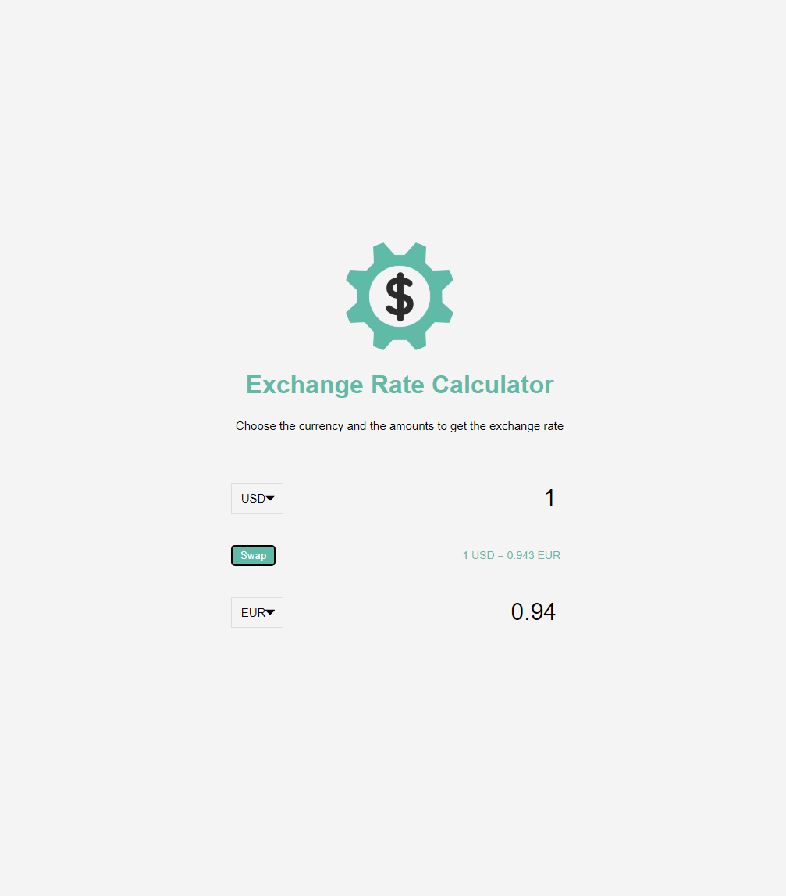
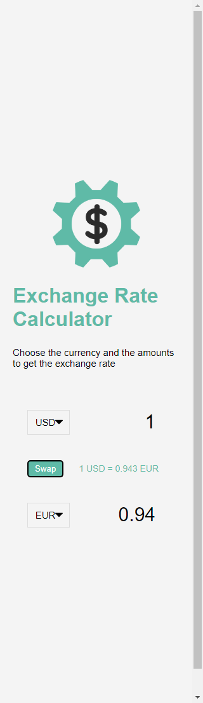

# EXchange rate calculator

## Table of contents

- [Overview](#overview)
  - [Screenshot](#screenshot)
  - [Links](#links)
  - [Built with](#built-with)

## Overview

Exchange rate calculator using the fetch api to make http request
to calculate the currency exchange of currency.

### Screenshot

### Links

- Solution URL: []

### Built with

- Semantic HTML5 markup
- CSS custom properties
- Flexbox
- vanilla javascript
